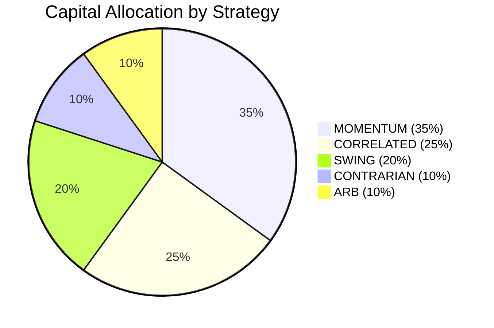
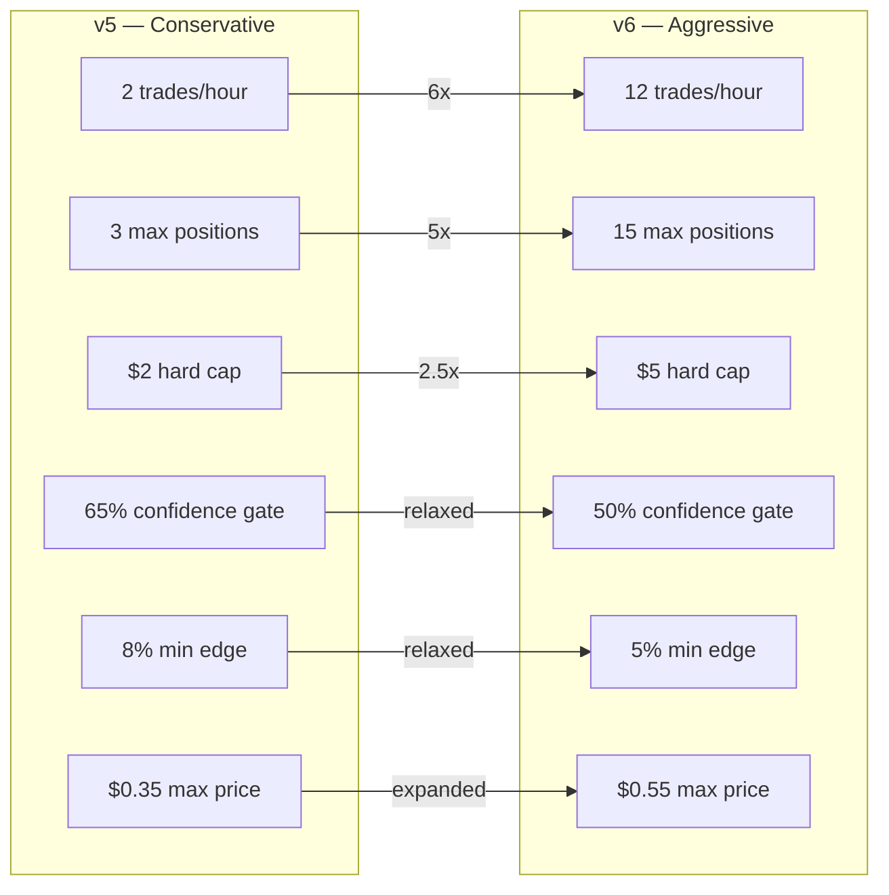
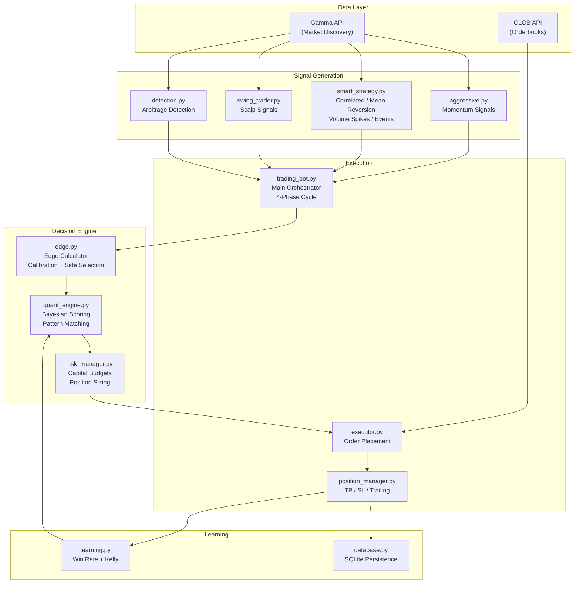
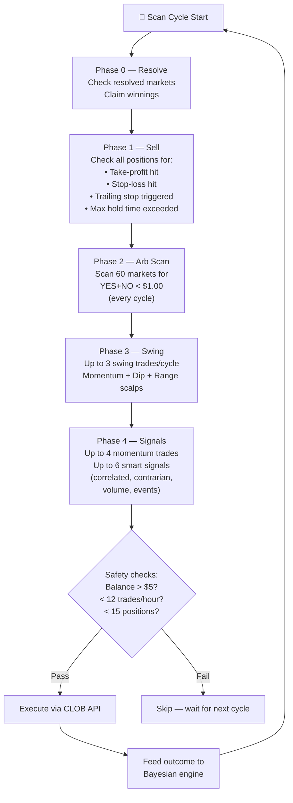
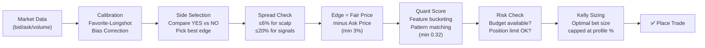
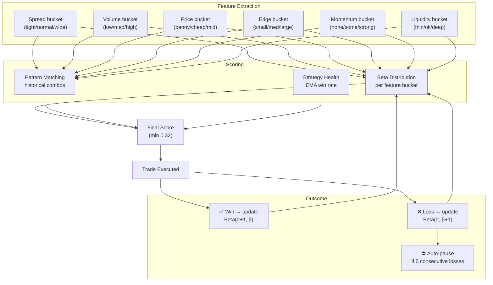

# Roger — Polymarket Autonomous Trading Bot

Roger is an autonomous prediction market trading bot for [Polymarket](https://polymarket.com). It scans live markets, identifies structural mispricings, and executes trades with adaptive risk management and Bayesian learning.

---

## Strategy Overview (v6 — Aggressive Quant)

Roger focuses on **buying cheap outcomes with structural edge**, then managing positions with tight stops and adaptive exits. v6 dramatically opens the trading gates — more strategies, more capital deployed, faster recycling.

### Strategy Allocation



| Strategy | Allocation | Per-Trade | Max Positions | Description |
|---|---|---|---|---|
| **MOMENTUM** | 35% | 12% | 6 | Buy tokens with strong price momentum + validated edge |
| **CORRELATED** | 25% | 12% | 5 | Exploit mispricings between related markets |
| **SWING** | 20% | 10% | 5 | Momentum/dip/range scalp for short-term gains |
| **CONTRARIAN** | 10% | 10% | 3 | Buy sharp dips in undervalued markets |
| **ARB** | 10% | 15% | 3 | Complement arbitrage (YES + NO < $1.00) |

### v5 vs v6 — What Changed



| Parameter | v5 | v6 | Rationale |
|---|---|---|---|
| Max trades/hour | 2 | **12** | Capital was sitting idle |
| Max open positions | 3 | **15** | Diversify across more markets |
| Hard cap per trade | $2.00 | **$5.00** | Allow meaningful positions |
| Bet size (signal) | $1.00 | **$2.00** | Deploy more capital per opportunity |
| Min confidence | 65% | **50%** | Strategy caps are ~0.70-0.80; 65% blocked everything |
| Min edge | 8% | **5%** | Opened up many valid opportunities |
| Max entry price | $0.35 | **$0.55** | More markets accessible |
| Take profit | +50% | **+40%** | Take wins faster, recycle capital |
| Stop loss | -30% | **-25%** | Cut losers faster |
| Trailing stop | 15% | **12%** | Lock in gains tighter |
| Max hold time | 72h | **48h** | Faster capital turnover |
| Dedup window | 6h | **2h** | Re-enter sooner if edge persists |

---

## Architecture



### File Map

```
polymarket_scanner/
├── trading_bot.py          # Main loop — 4-phase cycle (exits → arb → swing → signals)
├── trading_config.py       # All tunable parameters (balance, thresholds, limits)
├── risk_manager.py         # Per-strategy capital budgets and position limits
├── edge.py                 # Probability engine — calibration, edge calc, Kelly sizing
├── quant_engine.py         # Bayesian learning brain — scores trades, learns from outcomes
├── learning.py             # Win rate tracking, Kelly criterion, category performance
├── position_manager.py     # Active position management (TP/SL/trailing stops)
├── swing_trader.py         # Swing/scalp signal generation
├── aggressive.py           # Momentum + mispriced market signal generation
├── smart_strategy.py       # Correlated mispricings, mean reversion, volume spikes
├── executor.py             # Order execution (paper + live via py-clob-client)
├── resolution.py           # Tracks market resolutions and claims winnings
├── dashboard.py            # Web dashboard on localhost:8080
├── database.py             # SQLite schema and connections
├── detection.py            # Arbitrage detection logic
├── signals.py              # Whale tracking signals
├── ingestion/
│   ├── gamma.py            # Gamma REST API client (market discovery)
│   └── clob.py             # CLOB API client (orderbooks, order placement)
└── models.py               # Data models (Market, Outcome, Opportunity)
```

---

## How It Works

### Trading Loop (every 30 seconds)



### Edge Calculation Pipeline

Every opportunity goes through this pipeline before a trade is placed:



### Adaptive Learning (Quant Engine)

The Bayesian quant engine scores every trade opportunity and learns from outcomes:



### Risk Management

```
$25.00 Starting Balance
├── $5.00  Reserve (untouchable stop-loss floor)
├── $7.00  MOMENTUM budget (35%)
├── $5.00  CORRELATED budget (25%)
├── $4.00  SWING budget (20%)
├── $2.00  CONTRARIAN budget (10%)
└── $2.00  ARB budget (10%)

Per-trade: max 10-15% of strategy budget
Hard cap: $5.00 per order
Max positions: 15 open across all strategies
Max trades: 12 per hour
```

### Deduplication

- **Market-level**: Won't re-enter the same market within 2 hours
- **Token-level**: Tracks specific token IDs to prevent duplicates
- **Event-level**: Normalizes market questions so "Will X be 340-359?" and "Will X be 360-379?" are recognized as the same event — only 1 bet per event allowed

---

## Key Configuration (trading_config.py)

| Parameter | Value | Purpose |
|---|---|---|
| `STARTING_BALANCE` | $25.00 | Initial USDC balance |
| `STOP_LOSS_THRESHOLD` | $5.00 | Bot stops if balance drops below this |
| `MAX_ENTRY_PRICE` | $0.55 | Never buy above this price |
| `MIN_GLOBAL_CONFIDENCE` | 50% | Minimum confidence for any trade |
| `MIN_SIGNAL_EDGE` | 5% | Minimum expected edge |
| `HARD_MAX_COST_PER_TRADE` | $5.00 | Absolute dollar cap per order |
| `MAX_TRADES_PER_HOUR` | 12 | Rate limit |
| `MAX_OPEN_POSITIONS` | 15 | Concentration limit |
| `TAKE_PROFIT_PCT` | +40% | Default take-profit target |
| `STOP_LOSS_PCT` | -25% | Default stop-loss trigger |
| `TRAILING_STOP_PCT` | 12% | Trailing stop from high water mark |
| `MAX_HOLD_HOURS` | 48 | Auto-exit after 2 days |

---

## Setup

### Prerequisites

- Python 3.11+
- Polymarket account with API credentials (for live trading)

### Installation

```bash
python3 -m venv .venv
source .venv/bin/activate
pip install -r requirements.txt  # or: pip install httpx py-clob-client
```

### Configuration

Create a `.env` file with your Polymarket credentials (only needed for live trading):

```
POLYMARKET_API_KEY=your_api_key
POLYMARKET_SECRET=your_secret
POLYMARKET_PASSPHRASE=your_passphrase
PRIVATE_KEY=your_wallet_private_key
```

### Running

```bash
# Paper trading (default — no real money)
python3 -m polymarket_scanner.trading_bot

# Live trading (real USDC on Polygon)
python3 -m polymarket_scanner.trading_bot --live

# Custom scan interval (seconds)
python3 -m polymarket_scanner.trading_bot --interval 15

# Dashboard only (no trading)
python3 -m polymarket_scanner.trading_bot --dashboard-only
```

Or use the service runner:

```bash
./run_roger.sh start   # Start as background process
./run_roger.sh stop    # Stop gracefully
./run_roger.sh status  # Check if running
```

## Analysis Tools

```bash
# Trade summary — closed positions, P&L by exit reason
python3 analyze2.py

# Deep forensics — strategy breakdown, win rates, worst losses
python3 analyze_losses.py
```

## Dashboard

Web dashboard runs on `http://localhost:8080` showing:
- Active positions with unrealized P&L
- Recent trades
- Strategy allocation
- Win rate trends

## Database

All state is stored in `polymarket_scanner.db` (SQLite):

| Table | Purpose |
|---|---|
| `trade_history` | Every trade attempt with entry/exit/P&L |
| `managed_positions` | Active position tracking with TP/SL targets |
| `strategy_performance` | Aggregated stats per strategy |
| `category_performance` | Win rates by market category |
| `quant_state` | Persisted Bayesian learning state |
| `trade_features` | Feature vectors for every trade (offline analysis) |

## Historical Performance

| Strategy | Net P&L | Win Rate | Notes |
|---|---|---|---|
| MOMENTUM | +$25.82 | 86% (6W/1L) | Cheap long-shots with strong momentum |
| CORRELATED | +$18.80 | 100% TPs | Structural mispricing plays |
| SWING | -$4.17 | 57% but losses larger | Disabled in v5, re-enabled in v6 with tighter stops |
| ARB | $0.00 | 0 trades | Rare — complement pricing is usually efficient |

## License

MIT — see [LICENSE](LICENSE).
