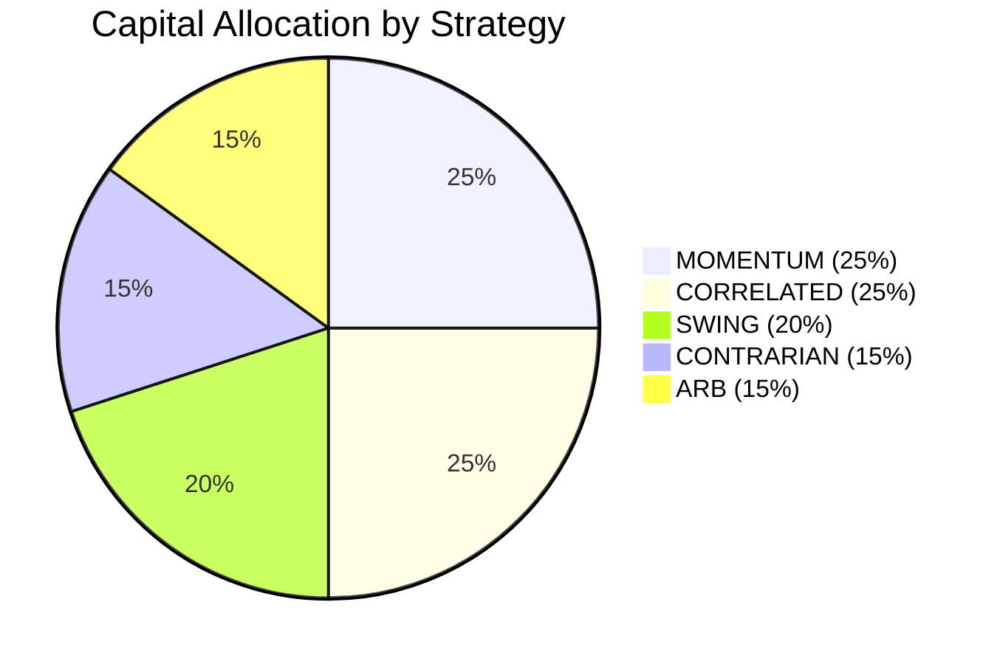
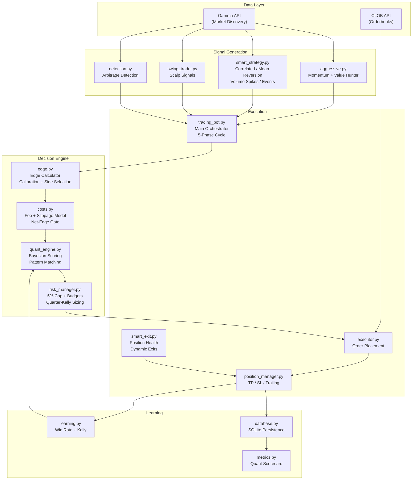
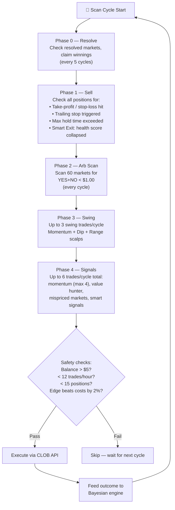
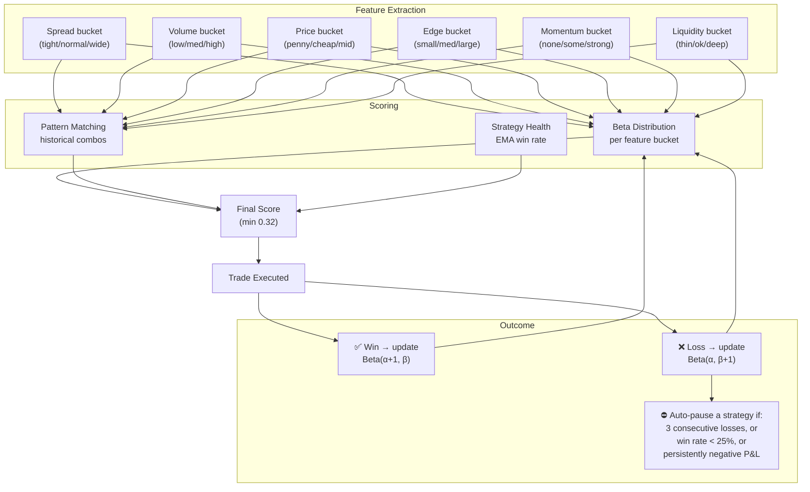

# Roger — Polymarket Autonomous Trading Bot

Roger is an autonomous prediction market trading bot for [Polymarket](https://polymarket.com). It scans live markets, identifies structural mispricings, and executes trades with adaptive risk management and Bayesian learning.

**Live tracker:** [diegocrisafu.github.io/expense](https://diegocrisafu.github.io/expense/) — a dashboard showing the bot's bets, positions, and market news. (Trading stats appear when the bot's local API is running; the public page always shows the news feed.)

---

## The Short Version (No Jargon)

Polymarket is a site where people bet on real-world questions — *"Will X win the election?"*, *"Will Y happen by March?"*. Each question has YES and NO shares that trade between $0.00 and $1.00. When the question resolves, the correct side pays out $1.00 per share and the wrong side pays $0.00. A YES share trading at $0.30 means the market thinks there's roughly a 30% chance it happens.

Roger's job is to find shares whose price looks **wrong** — for example a YES priced at 30¢ when the evidence says it should be 35¢ — buy them cheaply, and sell (or hold to payout) for a profit. It does this in a loop, all day, with strict rules about how much money it's allowed to risk on any single bet.

By default Roger runs in **paper mode**: it trades with imaginary money to prove its strategies work before any real dollars are used.

### Words used in this document

| Term | Plain meaning |
|---|---|
| **Edge** | How much better the fair price is than the price you pay. Buying at 30¢ what's worth 35¢ = 5% edge. |
| **Spread** | The gap between the best buy and sell prices. A wide spread is a hidden cost. |
| **Arbitrage** | When YES + NO cost less than $1.00 combined — buying both guarantees a profit. |
| **Take-profit / Stop-loss (TP/SL)** | Automatic sell rules: lock in a gain at +X%, or cut a loss at −Y%. |
| **Kelly sizing** | A formula for bet size: bet more when the edge is big, less when it's small. |
| **Paper trading** | Simulated trading with fake money, real prices. |

---

## Strategy Overview

Roger focuses on **buying cheap outcomes with structural edge**, then managing positions with tight stops and adaptive exits.

### Capital Allocation by Strategy


```mermaid
pie title Capital Allocation by Strategy
    "MOMENTUM (25%)" : 25
    "CORRELATED (25%)" : 25
    "SWING (20%)" : 20
    "CONTRARIAN (15%)" : 15
    "ARB (15%)" : 15
```

| Strategy | Allocation | Max Positions | Take-Profit | Stop-Loss | Max Hold | Description |
|---|---|---|---|---|---|---|
| **MOMENTUM** | 25% | 3 | +40% | −25% | 48h | Buy tokens with strong price momentum + validated edge |
| **CORRELATED** | 25% | 3 | +40% | −25% | 48h | Exploit mispricings between related markets |
| **SWING** | 20% | 4 | +8% | −5% | 24h | Momentum/dip/range scalps for quick, small gains |
| **CONTRARIAN** | 15% | 3 | +35% | −20% | 48h | Buy sharp dips in undervalued markets |
| **ARB** | 15% | 2 | +5% | −3% | 24h | Complement arbitrage (YES + NO < $1.00) |

Every strategy is capped at **5% of the current balance per trade** — no exceptions (see Risk Rules below).

There is also a **Value Hunter** mode inside the momentum strategy: it looks for cheap "lottery tickets" — outcomes priced under $0.15 with confirmed edge and real volume. Risk a nickel to maybe win 95¢. **Important caveat:** cheap outcomes are *not* automatically good bets. Prediction markets exhibit a well-documented **favourite-longshot bias** — longshots are systematically over-priced and resolve to $0 more often than their price implies. The edge engine (`edge.py`) corrects for this by nudging the true-probability estimate of longshots *down*, not up, so a cheap ticket only clears the edge gate when it is genuinely mispriced. A cheap price on its own earns no bonus.

---

## Risk Rules — The Hard Limits

These are enforced in code (`risk_manager.py` asserts them at import) and cannot be bypassed by any strategy:

```
$100.00 Starting Balance
├── $20.00  Reserve (20%) — kept out of trading; deployable = balance − reserve
├── $80.00  Circuit breaker — bot HALTS entirely if balance draws down to here
│            (a 20% loss). Reserve and halt are separate: at any balance the
│            halt protects ~80% of capital, instead of the old fixed $5 floor
│            that would have let a $100 balance bleed to $5 before stopping.
├── 5%      Max cost per trade (= $5.00 on a $100 balance, recomputed live)
├── $20.00  MOMENTUM budget (25% of deployable)
├── $20.00  CORRELATED budget (25%)
├── $16.00  SWING budget (20%)
├── $12.00  CONTRARIAN budget (15%)
└── $12.00  ARB budget (15%)

Max positions: 15 open across all strategies
Max trades:    12 per hour
Share floor:   Polymarket requires 5 shares/order — if that minimum would
               push a trade over the 5% cap, the trade is REJECTED, not inflated.
```

All of these scale with the balance: `RESERVE_FRACTION`, `MAX_DRAWDOWN_FRACTION`,
and `MAX_TRADE_FRACTION` in `trading_config.py` are the single source of truth,
so raising or lowering the account never leaves a stale absolute dollar limit.

### The Cost-Edge Gate

Paper profits that ignore fees are fiction. Before any trade, Roger estimates the full round-trip cost — **2% taker fee per leg + 0.5% slippage per leg + half the spread** — and rejects the trade unless the expected edge beats those costs by at least **2%**. Trades that pass are sized by **quarter-Kelly** on the net-of-cost edge (a deliberately conservative fraction of the "optimal" bet). This blocks most weak signals on purpose: those trades were losing money to fees.

### How the risk rules evolved

| Parameter | v5 | v6 | Today |
|---|---|---|---|
| Max trades/hour | 2 | 12 | 12 |
| Max open positions | 3 | 15 | 15 |
| Cap per trade | $2.00 | $5.00 | **5% of balance (~$1.25)** |
| Min confidence | 65% | 50% | 50% |
| Min edge | 8% | 5% | 5% gross **+ 2% net of costs** |
| Max entry price | $0.35 | $0.55 | $0.55 |
| Exit management | fixed TP/SL | tighter TP/SL | per-strategy profiles + Smart Exit |

---

## Architecture


```mermaid
graph TB
    subgraph "Data Layer"
        GAMMA["Gamma API<br/>(Market Discovery)"]
        CLOB["CLOB API<br/>(Orderbooks)"]
    end

    subgraph "Signal Generation"
        AGG["aggressive.py<br/>Momentum + Value Hunter"]
        SMART["smart_strategy.py<br/>Correlated / Mean Reversion<br/>Volume Spikes / Events"]
        SWING["swing_trader.py<br/>Scalp Signals"]
        DET["detection.py<br/>Arbitrage Detection"]
    end

    subgraph "Decision Engine"
        EDGE["edge.py<br/>Edge Calculator<br/>Calibration + Side Selection"]
        COSTS["costs.py<br/>Fee + Slippage Model<br/>Net-Edge Gate"]
        QUANT["quant_engine.py<br/>Bayesian Scoring<br/>Pattern Matching"]
        RISK["risk_manager.py<br/>5% Cap + Budgets<br/>Quarter-Kelly Sizing"]
    end

    subgraph "Execution"
        BOT["trading_bot.py<br/>Main Orchestrator<br/>5-Phase Cycle"]
        EXEC["executor.py<br/>Order Placement"]
        POS["position_manager.py<br/>TP / SL / Trailing"]
        SX["smart_exit.py<br/>Position Health<br/>Dynamic Exits"]
    end

    subgraph "Learning"
        LEARN["learning.py<br/>Win Rate + Kelly"]
        MET["metrics.py<br/>Quant Scorecard"]
        DB["database.py<br/>SQLite Persistence"]
    end

    GAMMA --> AGG & SMART & SWING & DET
    CLOB --> EXEC
    AGG & SMART & SWING & DET --> BOT
    BOT --> EDGE --> COSTS --> QUANT --> RISK --> EXEC
    EXEC --> POS --> DB
    SX --> POS
    POS --> LEARN
    LEARN --> QUANT
    DB --> MET
```

### File Map

```
polymarket_scanner/
├── trading_bot.py          # Main loop — 5-phase cycle (resolve → exits → arb → swing → signals)
├── trading_config.py       # All tunable parameters (balance, thresholds, limits)
├── risk_manager.py         # 5% per-trade cap, strategy budgets, quarter-Kelly sizing
├── edge.py                 # Probability engine — calibration, edge calc, expired-market filter
├── costs.py                # Transaction cost model — fees, slippage, net-edge gate
├── quant_engine.py         # Bayesian learning brain — scores trades, learns from outcomes
├── learning.py             # Win rate tracking, Kelly criterion, category performance
├── position_manager.py     # Active position management (TP/SL/trailing stops)
├── smart_exit.py           # Dynamic exits — re-scores position health every cycle
├── swing_trader.py         # Swing/scalp signal generation
├── aggressive.py           # Momentum + mispriced + value-hunter signal generation
├── smart_strategy.py       # Correlated mispricings, mean reversion, volume spikes
├── executor.py             # Order execution (paper + live via py-clob-client)
├── resolution.py           # Tracks market resolutions and claims winnings
├── metrics.py              # Performance scorecard (profit factor, expectancy, drawdown)
├── market_data.py          # Market snapshot capture for offline backtesting
├── dashboard.py            # Web dashboard on localhost:8080 (+ news API)
├── database.py             # SQLite schema and connections
├── detection.py            # Arbitrage detection logic
├── signals.py              # Whale tracking signals
├── ingestion/
│   ├── gamma.py            # Gamma REST API client (market discovery)
│   └── clob.py             # CLOB API client (orderbooks, order placement)
└── models.py               # Data models (Market, Outcome, Opportunity)
```

---

## How It Works

### Trading Loop (every 30 seconds)


```mermaid
flowchart TD
    START["🔄 Scan Cycle Start"] --> P0
    P0["Phase 0 — Resolve<br/>Check resolved markets, claim winnings<br/>(every 5 cycles)"] --> P1
    P1["Phase 1 — Sell<br/>Check all positions for:<br/>• Take-profit / stop-loss hit<br/>• Trailing stop triggered<br/>• Max hold time exceeded<br/>• Smart Exit: health score collapsed"] --> P2
    P2["Phase 2 — Arb Scan<br/>Scan 60 markets for<br/>YES+NO < $1.00<br/>(every cycle)"] --> P3
    P3["Phase 3 — Swing<br/>Up to 3 swing trades/cycle<br/>Momentum + Dip + Range scalps"] --> P4
    P4["Phase 4 — Signals<br/>Up to 6 trades/cycle total:<br/>momentum (max 4), value hunter,<br/>mispriced markets, smart signals"] --> GATE
    GATE{"Safety checks:<br/>Balance > $5?<br/>< 12 trades/hour?<br/>< 15 positions?<br/>Edge beats costs by 2%?"}
    GATE -->|Pass| EXEC["Execute via CLOB API"]
    GATE -->|Fail| SKIP["Skip — wait for next cycle"]
    EXEC --> LEARN["Feed outcome to<br/>Bayesian engine"]
    LEARN --> START
```

All signal scanners skip **expired or zombie markets** (already closed, or asking ≤ $0.005) and scan up to 200 live markets per pass.

### Edge Calculation Pipeline

Every opportunity goes through this pipeline before a trade is placed:


```mermaid
flowchart LR
    MKT["Market Data<br/>(bid/ask/volume)"] --> CAL["Calibration<br/>Favorite-Longshot<br/>Bias Correction"]
    CAL --> SIDE["Side Selection<br/>Compare YES vs NO<br/>Pick best edge"]
    SIDE --> SPREAD["Spread Check<br/>≤6% for scalp<br/>≤20% for signals"]
    SPREAD --> EDGE["Edge = Fair Price<br/>minus Ask Price<br/>(min 3%)"]
    EDGE --> COST["Cost Gate<br/>Edge must beat fees +<br/>slippage by ≥2%"]
    COST --> QUANT["Quant Score<br/>Feature bucketing<br/>Pattern matching<br/>(min 0.32)"]
    QUANT --> RISK["Risk Check<br/>Budget available?<br/>Position limit OK?"]
    RISK --> KELLY["Quarter-Kelly Sizing<br/>capped at 5% of balance"]
    KELLY --> TRADE["✅ Place Trade"]
```

### Adaptive Learning (Quant Engine)

The Bayesian quant engine scores every trade opportunity and learns from outcomes:


```mermaid
graph TB
    subgraph "Feature Extraction"
        F1["Spread bucket<br/>(tight/normal/wide)"]
        F2["Volume bucket<br/>(low/med/high)"]
        F3["Price bucket<br/>(penny/cheap/mid)"]
        F4["Edge bucket<br/>(small/med/large)"]
        F5["Momentum bucket<br/>(none/some/strong)"]
        F6["Liquidity bucket<br/>(thin/ok/deep)"]
    end

    subgraph "Scoring"
        BETA["Beta Distribution<br/>per feature bucket"]
        PAT["Pattern Matching<br/>historical combos"]
        STRAT["Strategy Health<br/>EMA win rate"]
    end

    subgraph "Outcome"
        WIN["✅ Win → update<br/>Beta(α+1, β)"]
        LOSE["❌ Loss → update<br/>Beta(α, β+1)"]
        PAUSE["⛔ Auto-pause a strategy if:<br/>3 consecutive losses, or<br/>win rate < 25%, or<br/>persistently negative P&L"]
    end

    F1 & F2 & F3 & F4 & F5 & F6 --> BETA & PAT
    BETA --> SCORE["Final Score<br/>(min 0.32)"]
    PAT --> SCORE
    STRAT --> SCORE
    SCORE --> TRADE["Trade Executed"]
    TRADE --> WIN & LOSE
    WIN & LOSE --> BETA
    LOSE --> PAUSE
```

### Smart Exit Engine

Fixed TP/SL rules can't see *why* a position is going wrong. Every 60 seconds the Smart Exit engine re-scores each open position's **health** (0–1) from live data — has the entry edge disappeared, is momentum reversing, is liquidity drying up, is the spread widening?

- Losing position with health **< 0.25** → cut the loss early, don't wait for the stop
- Winning position with health **< 0.40** → take the profit now, don't wait for the target

### Deduplication

- **Market-level**: won't re-enter the same market within 2 hours
- **Token-level**: tracks specific token IDs to prevent duplicates
- **Event-level**: normalizes market questions so "Will X be 340-359?" and "Will X be 360-379?" are recognized as the same event — only 1 bet per event allowed

---

## Key Configuration (trading_config.py)

| Parameter | Value | Purpose |
|---|---|---|
| `STARTING_BALANCE` | $25.00 | Initial USDC balance |
| `STOP_LOSS_THRESHOLD` | $5.00 | Bot stops if balance drops below this |
| `MAX_TRADE_FRACTION` | 5% | **Hard ceiling** — no trade may cost more than 5% of the current balance |
| `HARD_MAX_COST_PER_TRADE` | $1.25 | The 5% rule in dollars (recomputed from live balance) |
| `MAX_ENTRY_PRICE` | $0.55 | Never buy above this price |
| `MIN_GLOBAL_CONFIDENCE` | 50% | Minimum confidence for any trade |
| `MIN_SIGNAL_EDGE` | 5% | Minimum expected edge (gross) |
| `ENFORCE_COST_EDGE_GATE` | On | Reject trades whose edge can't beat fees + slippage by 2% |
| `MAX_TRADES_PER_HOUR` | 12 | Rate limit |
| `MAX_OPEN_POSITIONS` | 15 | Concentration limit |
| `SMART_EXIT_ENABLED` | On | Dynamic position health checks every 60s |
| `TAKE_PROFIT_PCT` / `STOP_LOSS_PCT` | +40% / −25% | *Default fallbacks* — each strategy has its own profile (see table above) |
| `MAX_HOLD_HOURS` | 48 | Default auto-exit (24h for ARB and SWING) |
| `CLEAN_DATA_SINCE` | 2026-07-03 | Trades before this date are excluded from performance stats (see below) |

---

## Setup

### Prerequisites

- Python 3.11+
- Polymarket account with API credentials (for live trading)

### Installation

```bash
python3 -m venv .venv
source .venv/bin/activate
pip install -r requirements.txt  # or: pip install httpx py-clob-client
```

### Configuration

Create a `.env` file with your Polymarket credentials (only needed for live trading):

```
POLYMARKET_API_KEY=your_api_key
POLYMARKET_SECRET=your_secret
POLYMARKET_PASSPHRASE=your_passphrase
PRIVATE_KEY=your_wallet_private_key
```

### Running

```bash
# Paper trading (default — no real money)
python3 -m polymarket_scanner.trading_bot

# Live trading (real USDC on Polygon)
python3 -m polymarket_scanner.trading_bot --live

# Custom scan interval (seconds)
python3 -m polymarket_scanner.trading_bot --interval 15

# Dashboard only (no trading)
python3 -m polymarket_scanner.trading_bot --dashboard-only
```

Or use the service runner:

```bash
./run_roger.sh start   # Start as background process
./run_roger.sh stop    # Stop gracefully
./run_roger.sh status  # Check if running
```

## Analysis Tools

```bash
# Trade summary — closed positions, P&L by exit reason
python3 analyze2.py

# Deep forensics — strategy breakdown, win rates, worst losses
python3 analyze_losses.py
```

## Dashboard

The web dashboard runs locally at `http://localhost:8080` and is mirrored on [GitHub Pages](https://diegocrisafu.github.io/expense/):

- **Dashboard** — balance, today's P&L, win rate, equity curve, strategy charts, a trading calendar (each day colored by that day's profit or loss), and average P&L by weekday
- **Bets** — every bet with a plain-English explanation of why it was placed
- **Positions** — open positions with live P&L and TP/SL targets, plus recent exits
- **News** — market-moving headlines by category, refreshed every 15 minutes

Light/dark theme included. The page prefers the live local API; when that's unreachable (i.e. on GitHub Pages) it falls back to a published `data.json` snapshot and shows how old the data is. To refresh the public tracker:

```bash
./publish_tracker.sh          # publish once, right now
./setup_publish_schedule.sh   # one-time: auto-publish daily at 09:00 and 21:00 (macOS launchd)
```

## Database

All state is stored in `polymarket_scanner.db` (SQLite):

| Table | Purpose |
|---|---|
| `trade_history` | Every trade attempt with entry/exit/P&L |
| `managed_positions` | Active position tracking with TP/SL targets |
| `strategy_performance` | Aggregated stats per strategy |
| `category_performance` | Win rates by market category |
| `quant_state` | Persisted Bayesian learning state |
| `trade_features` | Feature vectors for every trade (offline analysis) |
| `snapshots` / `orderbook_levels` | Market data capture for offline backtesting |

## Performance & Data Quality — read this before trusting any number

A full audit of the trade ledger found the reported track record was **fabricated by placeholder exit prices**. Every single winning trade in the database exited at exactly `0.5`, `0.99`, or `0.999` — none exited at a real market price. Those are internal placeholders, not fills:

- **`0.5`** — an old default (pre-2026-07-03, quarantined by `CLEAN_DATA_SINCE`).
- **`0.99` / `0.999`** — the take-profit path trusting a near-$1 orderbook **bid** on a market that had actually *resolved*, and booking it as a win. This one **kept happening after the cutoff** (e.g. "Switzerland win the 2026 World Cup", bought at 2¢, "sold" at 99.9¢ on 2026-07-09).

Counting only trades that closed at genuine market prices, the honest record is **0 verifiable wins and roughly −$46**. The headline "+$211 / 29% win rate" was ~127% placeholder profit. The bot got lucky-looking on paper; it never actually had an edge.

**What was fixed** (`resolution.py`, `position_manager.py`): resolved markets are now settled at the **true on-chain outcome of the token we hold** ($0 or $1), and the exit path refuses to book a near-$1 bid as profit without confirming the market really resolved in our favour. So the scorecard is honest going forward. `metrics.py` computes win rate / profit factor / expectancy / max drawdown from clean data only, and that is the gate for any real-money allocation.

## The Information Edge — the only path to real profit (experimental, off by default)

The edge engine can only ever reprice the market's own quotes, so on its own the bot has **no independent information** and, after costs, no real edge. `information.py` fills the dormant `external_prob` hook: it pulls targeted news for a specific market, asks an LLM for a calibrated probability, and lets the bot bet **only when that independent estimate diverges from the market price by more than trading costs**. It gates the value-hunter path — a cheap longshot must be *confirmed* underpriced by outside information, not bought just for being cheap.

This is a **mechanism, not a proven money-maker.** It stays completely inert unless you set `INFO_EDGE_ENABLED=1`, provide `ANTHROPIC_API_KEY`, and `pip install anthropic`. Validate it in paper mode across many *resolved* markets before trusting it with a dollar.

## License

MIT — see [LICENSE](LICENSE).

## License

MIT — see [LICENSE](LICENSE).

---

Made by Diego Crisafulli.
